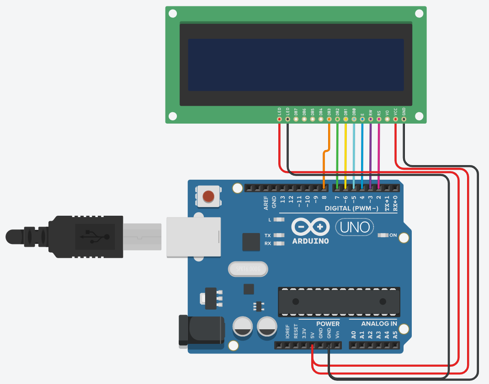

## Introduction
The purpose of this program is to monitor the devices, collect information, analyze them and notify if any problem.
Program contains various modules, that can be used individually. E.g. you can download and use only host resource monitor. After that you can downlad and use device visualizer module on [Arduino](https://arduino.cc/) as well. For instructions how to do that, see [below](#Instructions)

## Downloads
There are downloads available for **Linux** and **Windows** machines. Here are fast references to them

## Instructions
To use this software, you have to download the product from links [above](#Downloads). Here are detailed instructions on configurations for each module.

- ### monitorX *host*

    * **Windows** - This module doesn't need any configurations.
    * **Linux** - Set the `LD_LIBRARY_PATH` variable to the `<dir>/monitorX/build/lib` path relative this folder using the following command
    
    ``` shell
        export LD_LIBRARY_PATH=$LD_LIBRARYPATH;<dir>/monitorX/build/lib
    ```

- ### monitorX *Arduino visualizer*

    For this module you will need to upload code to an Atmega MCU. You can use [Arduino IDE](https://www.arduino.cc/en/Main/Software) to build and upload the code. *Binaries for some boards are included*. After this process open the [`monitorX host`](#monitorx-host) application and
    
    * **Windows** - in `Connect` menu select the port to connect.
    * **Linux** - click `Connect` in menu bar and input the port's full path. E.g. `/dev/ttyS1`

    Connect your LCD module to your Arduino board following this scheme. *Provided binaries are builded for this connection and for 20x4 sized LCD modules*

    
